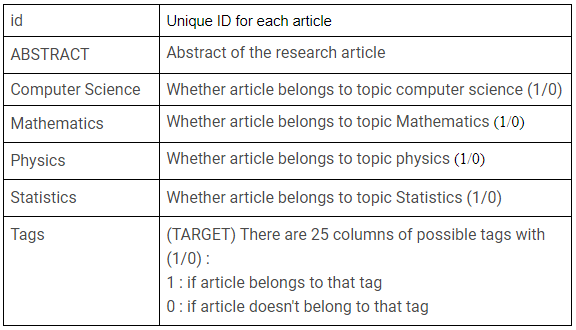
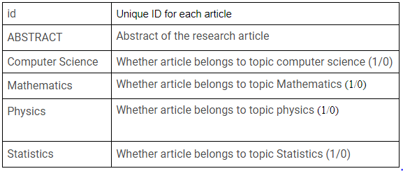
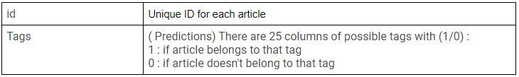

Topic Modeling for Research Articles
-------------------
* Notebook containing the exploratory data analysis and the modeling used to reach
a top 5 score in the Analytics Vidhya Topic Modeling for Research Articles 2.0 Hackathon
(https://datahack.analyticsvidhya.com/contest/hacklive-3-guided-hackathon-text-classification/#ProblemStatement)
* The challenge consisted of using the natural language processing (NLP) to predict 25 tags for each scientific article
based on its abstract and a broad category.
* The training set contained the following data:

* The test set looked as follows:

* And the sample submission:

* In my approach I decided to use state-of-the-art pretrained NLP models called transformers.
Specifically the BERT, roBERTa, ELECTRA, distilBERT and XLM-roBERTa
* In the next step I used the obtained predictions along with the categorical data from the dataset
to train a Deep Neural Network meta-learner that significantly improved the performance on the leaderboard
and allowed me to reach the final F1-score of 0.781

Installation
-------------------
* Clone this repository to your computer
* Get into the folder using cd Hacklive-NLP
* Install the required libraries using pip install -r requirements.txt

Usage
-------------------
* Open the Hacklive NLP.ipynb file in the jupyter notebook
* In the kernel menu click on 'Restart & run all'
* A preferred method is to use the website https://nbviewer.jupyter.org
* Once there you can just paste the github link to the notebook and it will render it 
